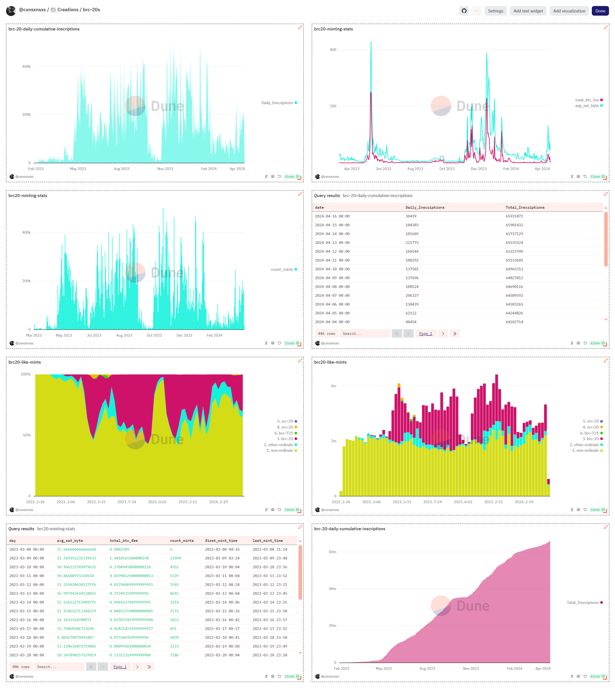

# Dune-School-of-Wizardry(dune.com) 

Dune is a web-based platform that allows you to query public blockchain data and aggregate it into custom beautiful dashboards, charts using plain SQL.
 

 https://dune.com/cxnsxnsxs

